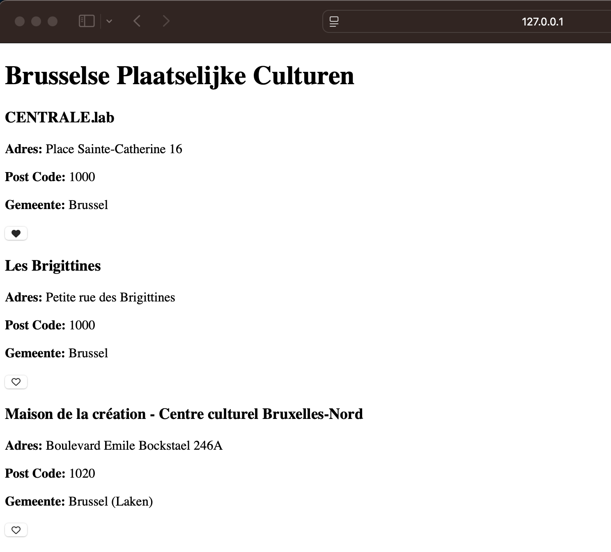
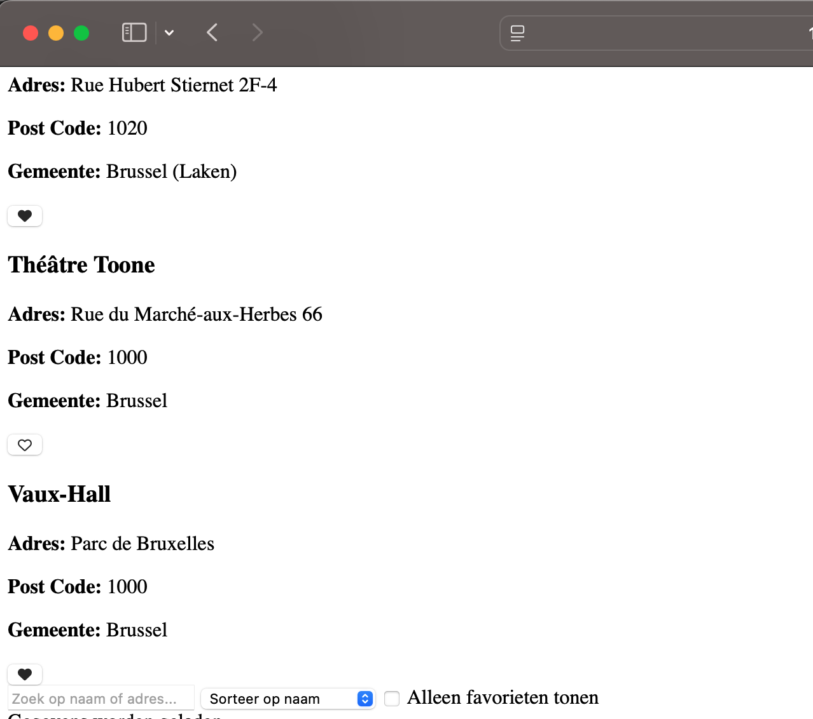
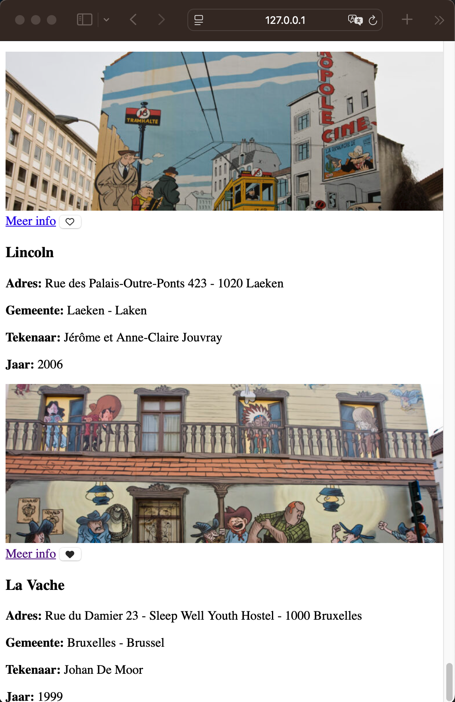
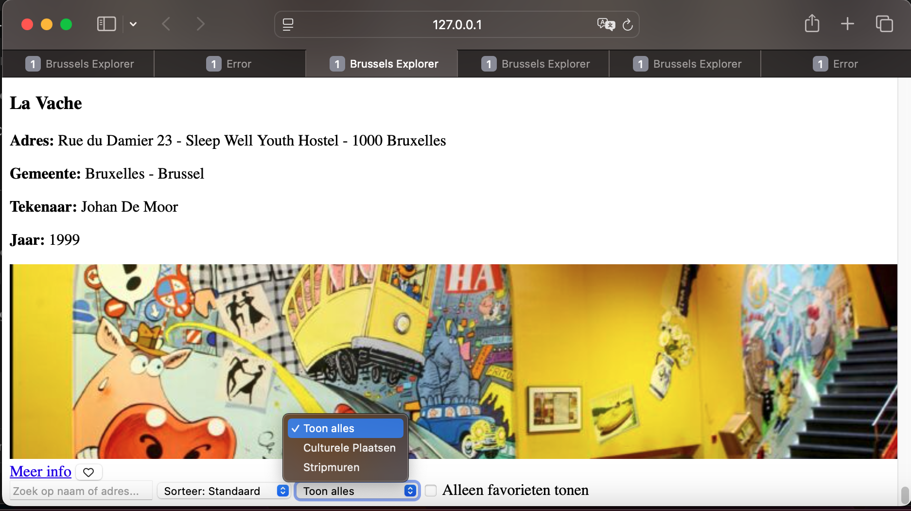

BrusselsExplorer

*Een interactieve webapplicatie waarmee gebruikers culturele locaties in Brussel kunnen ontdekken. De app maakt gebruik van de open data 	API van opendata.brussels.

---

Projectstatus

- (done) GitHub-repository aangemaakt  

- (done) Basisbestanden (HTML, CSS, JS) zijn opgezet  

- (done) Dataset gekozen via opendata.brussels  

- (done) Taakverdeling tussen teamleden vastgelegd  

- (done) Eerste versie: data ophalen & weergeven (description, adres, postcode, gemeente)  

- (done) Favorieten kunnen worden opgeslagen (❤️ button met localStorage)  

- (done) Sorteren en filtering zijn nog niet geïmplementeerd  

- (nog niet) Design nog niet geoptimaliseerd

Screenshots van de applicatie:

 Update 2 - Extra functionaliteiten
 
- Sorteeroptie toegevoegd (op naam & postcode)
- Filter "Alleen favorieten tonen"

Screenshots van de applicatie:

 

 Update 3 – Stripmuren Integratie

- Tweede API toegevoegd: bruxelles_parcours_bd (stripmuren in Brussel)
- Weergave van stripmuren als aparte kaarten met:
- Titel van de muurschildering
- Adres en gemeente
- Tekenaar en jaar
- Afbeelding van de muurschildering
- Link naar de officiële site
- Favorietenfunctionaliteit werkt ook voor stripmuren
- Zoek optie werkt op beide datasets tegelijk

Screenshots van de applicatie:

Update 4 – Geavanceerde zoek en filter Functionaliteit

- Zoekoptie uitgebreid met tekenaar en jaar voor stripmuren
- Filter op type: Culturele locaties, Stripmuren, of Alle
-  Alle zoek, filter en sorteer functies werken

Screenshots van de applicatie:

 
---

- Taakverdeling

# Abdullah:
    - API Data ophalen en verwerken
        Fetch aanvragen voor culturele locaties en stripmuren
        Data omzetten naar JSON en verwerken
        Foutafhandeling bij API-aanvragen
    - Zoekfunctie implementeren
        Input uitlezen
        Gegevens filteren op zoektermen
        Resultaten updaten in de DOM
    - Sorteren en filteren van gegevens
         Sorteerfunctie maken voor naam en postcode
         Gegevens tonen op basis van filters (cultureel of stripmuren)

# Huzeyfe:
    - Favorieten beheren
        Opslaan en verwijderen van favorieten in localStorage
        Knoppen en iconen updaten bij interactie
    - Thema (licht/donker) wisselen
        Event listener voor knop
        Thema opslaan in localStorage
        Klassen toevoegen/verwijderen in de DOM
    - Taalwissel functionaliteit
        Opslaan en toepassen van taalkeuze
        Herladen van de pagina bij wijziging
    - Geolocatie en weergave
        Huidige locatie ophalen via navigator.geolocation
        Locatie opslaan in localStorage
        Adresgegevens ophalen via OpenStreetMap API

--- 

- Functionaliteiten (tot nu toe)
	Lijstweergave van culturele locaties in Brussel
	Zoekfunctie op naam of adres
	Gebruikers kunnen locaties toevoegen aan favorieten
	Favorieten worden opgeslagen in localStorage en blijven behouden
	Responsive layout met eenvoudige navigatie

--- 

- Bestandenstructuur
	index.html – basisstructuur van de webpagina
	style.css – styling met focus op gebruiksvriendelijkheid
	app.js – logica voor data ophalen, tonen, zoeken en favorieten

## Technische vereisten

// Culturele locaties API
const API_URL = "https://opendata.brussels.be/api/explore/v2.1/catalog/datasets/bruxelles_lieux_culturels/records?limit=100";
const API_STRIP = "https://opendata.brussels.be/api/explore/v2.1/catalog/datasets/bruxelles_parcours_bd/records?limit=20";

// DOM-manipulatie: Elementen selecteren
const container = document.getElementById("gegevens");
const plaatsStripMuren = document.getElementById("stripmuren");
const gegevensFilter = document.getElementById("gegevens_filter");
const zoekInput = document.getElementById("zoek_optie");
const sorteerSelect = document.getElementById("sorteer_optie");
const alleenFavorietenCheckbox = document.getElementById("toon-favorieten");

// Gebruik van LocalStorage: Favorieten opslaan en ophalen
let favorieten = JSON.parse(localStorage.getItem("favorieten")) || [];
let stripMuren = [];

// Functie voor thema-wissel (DOM manipulatie + LocalStorage)
function applyTheme(theme) {
  document.body.classList.toggle("dark", theme === "dark");
}
const savedTheme = localStorage.getItem("theme") || "light";
applyTheme(savedTheme);

document.getElementById("theme-toggle").addEventListener("click", () => {
  const newTheme = document.body.classList.contains("dark") ? "light" : "dark";
  applyTheme(newTheme);
  localStorage.setItem("theme", newTheme);
});

// Data ophalen (Fetch API + Promises)
fetch(API_URL)
  .then(response => response.json())
  .then(data => {
    const plaatsen = data.results;

    // Array methodes: sorteren
    function sorteerPlaatsen(lijst, optie) {
      if (optie === "naam") {
        lijst.sort((a, b) => (a.description || "").localeCompare(b.description || ""));
      } else if (optie === "postcode") {
        lijst.sort((a, b) => (a.code_postal || 0) - (b.code_postal || 0));
      }
    }

    // Weergave van culturele plaatsen
    function plaatsLijst(lijst) {
      container.innerHTML = "";
      sorteerPlaatsen(lijst, sorteerSelect.value);
      
      lijst.forEach(place => {
        if (gegevensFilter.value !== "alle" && gegevensFilter.value !== "cultureel") return;
        
        const id = `${place.description || "onbekend"} - ${place.adresse || "onbekend"}`;
        const isFavoriete = favorieten.includes(id);
        
        // Template literals voor HTML-output
        const div = document.createElement("div");
        div.classList.add("gegevens");
        div.innerHTML = `
          <h3>${place.description || "Geen info"}</h3>
          
<strong>Adres:</strong> ${place.adresse || "Geen info"}

          
<strong>Postcode:</strong> ${place.code_postal || "Geen info"}

          <button class="favoriete_knopje ${isFavoriete ? "actief" : ""}" data-id="${id}">
            <i class="${isFavoriete ? "fas" : "far"} fa-heart"></i>
          </button>
        `;

        // Event listener op knop (callback function + DOM manipulatie)
        div.querySelector(".favoriete_knopje").addEventListener("click", () => {
          const icon = div.querySelector("i");
          if (favorieten.includes(id)) {
            favorieten = favorieten.filter(fav => fav !== id);
            icon.className = "far fa-heart";
          } else {
            favorieten.push(id);
            icon.className = "fas fa-heart";
          }
          localStorage.setItem("favorieten", JSON.stringify(favorieten));
        });

        container.appendChild(div);
      });
    }

    plaatsLijst(plaatsen);
  })
  .catch(error => {
    console.error("Error 404. Probeer opnieuw.", error);
    container.innerText = "Kan gegevens niet laden.";
  });

// Observer API voorbeeld (voor toekomstige uitbreiding)
const observer = new IntersectionObserver(entries => {
  entries.forEach(entry => {
    if (entry.isIntersecting) {
      console.log("Element zichtbaar in viewport", entry.target);
    }
  });
});
document.querySelectorAll(".gegevens").forEach(el => observer.observe(el));
